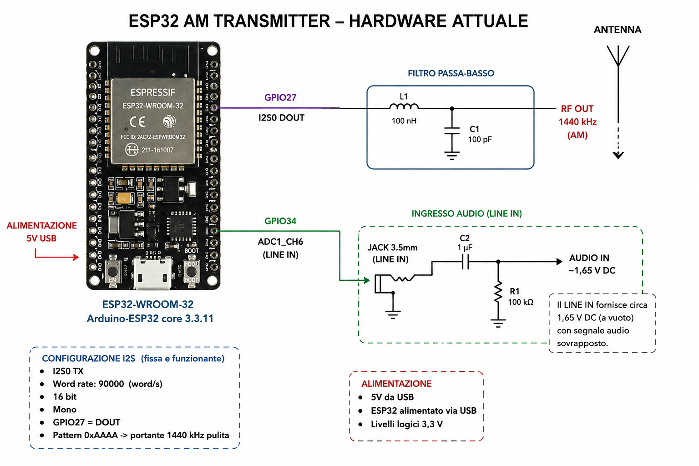
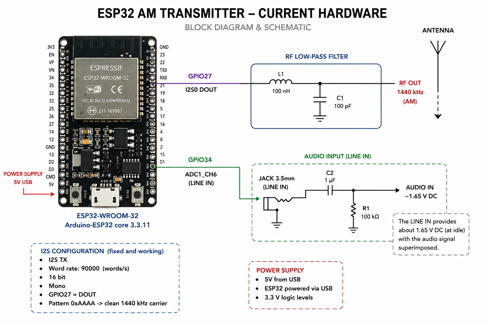

# Hardware diagrams / Schemi hardware

## Current diagram / Schema attuale

### Italiano

### English

This image records the experimental setup supplied by the project author. It
must not be treated as a certified RF output or antenna interface. / Questa
immagine documenta il montaggio sperimentale fornito dall'autore del progetto.
Non deve essere considerata un'uscita RF certificata o un'interfaccia pronta
per antenna.

